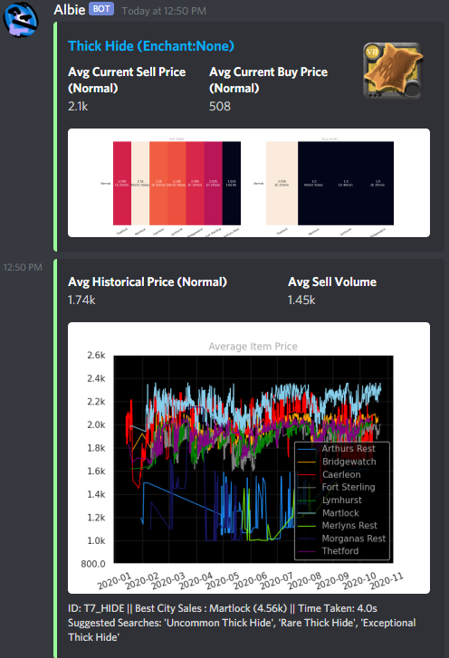

# Albion Online Discord Assistant Bot
  

Thanks to the [Albion Online Data Project](https://www.albion-online-data.com/), and the many players that download and run the Data Project [client](https://github.com/BroderickHyman/albiondata-client/releases) while playing the game, market price data are collected and shared freely with all Albion players. Perhaps the most popular tool that utilized these data is [AlbionOnline2D](https://www.albiononline2d.com/en/item).

The Discord bot fetches the latest minimum sell order prices (same as AlbionOnline2D), and plots the past 7 days historical prices, for the item that you asked. (Notice the typo 'lether' instead of 'leather'). The assistant will find the closest match to your query and also provides item suggestions in case you forgot how to spell. What a sweet assistant.

## How do I get the Assistant?

Unfortunately I am unable to host the bot right now. So you would have to **host it yourself**.

### Getting Started

#### Create a Discord bot account

1. First go to Discord's [developer portal](https://discordapp.com/developers/applications/).
2. Create an application by clicking on **New Application**.
3. Click on your newly created application, and on the left panel click on **Bot**.
4. Build a bot by clicking on **Add Bot**.
5. You have now created a bot account.

#### Run the Assistant as your bot account

1. Download all the files in this repository, and the requirements. (Look at **Requirements** below)
2. In your bot page in Discord's developer portal, copy the bot's **TOKEN**.
3. Edit **config.ini**, and change `botToken = abcdefghijklmnopqrstuvwxyz` to `botToken = your copied token`. This is to tell the program to use your bot account.
4. Open **cmd** or your **terminal** in the directory where you downloaded the files. Run `python main.py`.
5. Your bot should now be hosted on your computer and you should see the message:
```
Logged in as Bot_Username#1234.
Connected to:
```

#### Invite your Assistant bot

1. In your application page in Discord's developer portal, click on **OAuth2**.
2. Under **Scopes** tick the **bot** box.
3. Choose the **Bot Permissions** below as you like.
4. Copy the link under **Scopes** once done, and open in your browser.
5. Choose your server and go through annoying reCaptcha and you are done.
6. Everytime you start the bot, the message will now say:
```
Logged in as Bot_Username#1234
Connected to:
Your server name
```

#### Extras

1. Inside **config.ini** you can change or append:
```ini
adminUsers = 'username1#1234', 'username2#1234'
commandPrefix = 'emilie ', 'Emilie '
```
  + commandPrefix is how the bot should be called.
  + Being an admin user allows you to load/unload/reload cogs, and access **utils.py** commands.
  + The **utils.py** cog contain powerful commands that should only be callable by admin users.
  + Such commands can be abused to spam the server or to kick members. (Refer to **Features** below)

2. You can also change:
```ini
debugChannelID = 12345678
workChannelID = 12345678, 12345678
debug = False
onlyWork = False
```
  + If **debug** is True, then the bot will send debug messages to the channel specified by **debugChannelID**.
  + If **onlyWork** is True, then bot will only work in channels specified by **workChannelID**.
  + Channel IDs can be obtained by first enabling developer mode in Discord under Settings>Appearance. Then right clicking on a channel and click on Copy ID.

### Requirements

+ Python 3.6 or higher
+ [discord.py](https://github.com/Rapptz/discord.py)
  + The bot is written with discord.py, an async API.
+ [flask](https://flask.palletsprojects.com/en/1.1.x/)
  + flask is a micro web framework to host your bot.
+ [matplotlib](https://matplotlib.org/)
  + matplotlib is required to plot the 7 days historical prices.

  To install the required Python libraries, run the command:
  ```
  pip install discord.py flask matplotlib
  ```
  Or if you have `conda` installed:
  ```
  conda install discord.py flask matplotlib
  ```

## Features

```
.price <item name>
```
+ Returns latest minimum sell order prices as Discord embed, and plots 7 days historical prices. (First screenshot)
```
.search <option> <player/guild name>
```
+ `<option>` can be `player` or `guild`.
+ Search and returns details about a player/guild.

"# Albie" 
